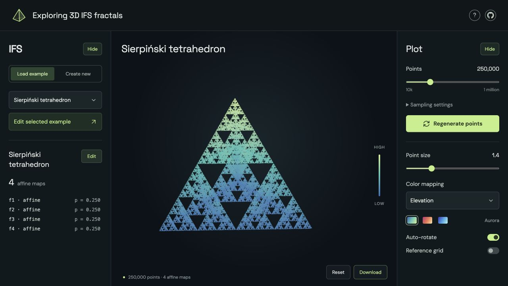

# Exploring 3D IFS fractals

Create and explore three-dimensional iterated function systems in your browser.
Built with **TypeScript, Three.js, and Vite**—no backend or API keys required.

**[Open the explorer →](https://zfengg.github.io/3D-IFS-Fractals/)**

[](https://zfengg.github.io/3D-IFS-Fractals/)

## Explore and create

- **Load an example:** Sierpiński tetrahedron, Menger, Barański, Bedford–McMullen, Vicsek, Cantor dust, a twisted tetrahedron, and a branching tree.
- **Edit an IFS:** combine affine matrices and nonlinear expressions; import or export JSON.
- **Shape a Bernoulli convolution:** drag the three matrix columns in a 3D cube preview; both maps share the linear part with editable translations, initially `(0,0,0)` and `(1,1,1)`.
- **Design a sponge:** define its grid, select cells layer by layer, and inspect a live 3D preview.
- **Adjust the plot:** point count, size, colors, rotation, and an optional reference grid.
- **Download:** tightly cropped PNG, PDF, or JPEG; transparent background by default where supported.

| Sponge | Define its grid |
| --- | --- |
| Menger | One size, e.g. `3 × 3 × 3` |
| Bedford–McMullen | A size for each axis, e.g. `3 × 4 × 5` |
| Barański | Positive interval widths summing to 1 on each axis |

Map weights are positive probabilities summing to 1. **Uniform** assigns equal weights; grid widths and map weights are independent.

**BM sponge with MFD = MME** reproduces Example 7.1 of [Zhou Feng, *On the coincidence of the Hausdorff and box dimensions for some affine-invariant sets*](https://doi.org/10.1017/etds.2025.10208): six equally weighted maps with linear part `diag(1/64, 1/16, 1/8)` and digit vectors `(0,0,0)`, `(0,1,0)`, `(0,2,0)`, `(0,3,0)`, `(0,0,1)`, `(1,0,1)`. Each translation is the digit vector multiplied by that matrix.

All three surface examples use the Weierstrass-type series `h(x,y) + Σ λⁿ φ(2ⁿx,2ⁿy)`. They are continuous graphs over `[0,1]²`, sampled by four equally weighted maps:

| Surface | Definition and parameters |
| --- | --- |
| Weierstrass | `Σ λⁿ sin(2π·2ⁿx) sin(2π·2ⁿy)`, λ = 0.65 |
| Takagi-type | `Σ λⁿ [τ(2ⁿx) + τ(2ⁿy)]`, λ = 0.6 |
| Interpolation terrain | `h(x,y) + 0.8 Σ 0.45ⁿ τ(2ⁿx)τ(2ⁿy)`, with `h = 0.2x + 0.35y − 0.45xy` |

Here `n ≥ 0` and `τ(t) = 2 dist(t, ℤ)` is the periodic tent function. The terrain interpolates the four corner heights of `h` and height 0.9625 at the center. **Edit IFS** opens a shared surface editor with sine-product, tent-product, tent-sum, and custom summands, editable λ, and base h(x,y); arbitrary edits need not preserve a continuous graph. The Takagi maps are affine because the tent function is linear on each half-period.

## How it works

**IFS maps + probabilities → chaos-game sampling → interactive WebGL point cloud**

The [chaos game](https://en.wikipedia.org/wiki/Chaos_game) repeatedly applies a randomly selected map and plots the resulting points. An `IFS` object owns the maps, validation, and seeded sampling. A Web Worker generates points while Three.js renders them. During camera movement, adaptive detail keeps interaction responsive; full detail returns when movement settles and is used for exports.

## Run locally

Use Node.js 22.12+.

```sh
npm ci
npm run dev
```

- `npm test` — check sampling, expressions, and validation.
- `npm run build` — type-check and build the static site into `dist/`.

## Deploy

This repository deploys to **GitHub Pages** automatically on pushes to `main`, after tests and the production build pass. To deploy a fork, select **Settings → Pages → Source → GitHub Actions**. You can also host `dist/` on any static web host.

## License

[MIT](LICENSE) © 2026 zfengg.
